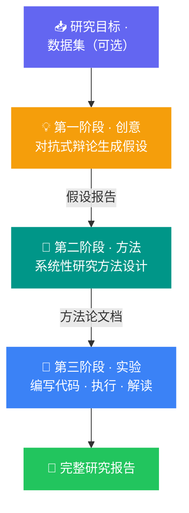

<div align="right">
  🇨🇳 中文 &nbsp;|&nbsp; <a href="./README.en-US.md">🇺🇸 English</a>
</div>

<div align="center">

# 🌌 Eureka

**Real outputs from Eureka × AutoSeek — 探索不止，发现不断**

[](https://go.eureka-ai.top)
[](https://github.com/crewAIInc/crewAI)
[](https://go.eureka-ai.top)
[](#)

<br/>

> 这里的每一份研究报告，都由 AI 从零开始独立完成——
> **没有人类干预，没有预设结论，只有数据、目标，和自主思考。**

<br/>

**[🚀 立即体验](https://go.eureka-ai.top) · [📖 了解工作原理](#-工作原理) · [📂 浏览样本](#-样本列表)**

</div>

---

## 这个仓库是什么？

**Eureka-Samples** 收录了 [Eureka × AutoSeek](https://go.eureka-ai.top) 平台真实运行产出的完整研究案例。

每个样本都是一次完整的自主科学发现过程的原始记录：从研究假设的生成，到方法论的设计，再到数据分析代码的编写与执行——全程由多智能体系统独立完成，**展示的是真实能力，而非精心筛选的演示**。

---

## 🔬 工作原理

Eureka 通过三个严格顺序执行的自主阶段完成一次完整的科学研究：



每个阶段均由专门的 AI Agent 协作完成：**Planner 规划员 · Engineer 工程师 · Reviewer 审查员 · RAG Researcher 检索研究员**

---

## 🎯 最适合的任务类型

Eureka 在具有**明确、可量化验证终点**的任务上表现最为可靠——即系统能通过代码执行验证结果的场景。

| 领域 | 示例目标 | 验证信号 |
|---|---|---|
| 📊 **数据分析** | CSV 探索性分析、相关性研究、异常检测 | 图表 + 统计输出 |
| 📈 **量化策略原型** | 动量策略回测、GARCH 模型比较 | 夏普比率、最大回撤 |
| 🧮 **算法验证** | 实现并基准测试排序/图遍历算法 | 运行时曲线、测试结果 |
| 🔬 **数学仿真** | 洛伦兹吸引子、SIR 传染病模型、双摆 | 数值收敛性 |
| 📐 **假设验证** | 在合成或真实数据上验证统计主张 | p 值、置信区间 |

> 💡 **没有数据集？** 系统可为仿真和算法任务自动生成合成数据，以下示例均无需上传文件。

**提示词示例：**

```text
使用 matplotlib 绘制三维莫比乌斯带。

模拟两种不同初始条件下的双摆运动，
绘制轨迹散度随时间变化的曲线以量化混沌程度。

实现快速排序与归并排序，在 1K / 10K / 100K
规模的数组上基准测试，并绘制时间复杂度曲线。

使用 GBM 和 GARCH(1,1) 模型模拟股票价格路径，
可视化比较两种方法的波动率聚集特征。

从双峰分布生成 500 个样本，验证 KS 检验是否
在 α=0.05 显著性水平下正确拒绝正态性假设。
```

---

## 📂 样本列表

仓库中的每个目录对应一次完整的研究运行，目录名为任务的唯一 ID。

---

### 📘 Sample 1 · 教育干预的时间动态效应

> **研究领域**：教育学 / 量化社会科学
> **语言**：English

**研究假设（Phase 1 输出）**

> *Catching Up and Leveling Off: A Dynamic Simulation of How Temporary Learning
> Rate Boosts Generate Larger Effects for Low-Achievers*
>
> 本研究假设：针对基础学习技能的干预措施，通过暂时提升低成就学生的学习速率，产生加速追赶效应。
> 模拟结果预期表明：干预效应并非静态，而是在中间时间点达到峰值后因效应衰减与掌握度上限的共同作用而下降，
> 这一峰值效应远超传统简单前后测设计所能捕捉的范围。

<div align="left">
  
</div>

📁 [`59d59dd0-d095-4ee4-8bd3-076486cc2cea/`](./59d59dd0-d095-4ee4-8bd3-076486cc2cea/)

---

### 📗 Sample 2 · 个性化教育干预的匹配效应模拟

> **研究领域**：教育学 / 精准教育
> **语言**：中文

**研究假设（Phase 1 输出）**

> **因材施教的增益：通过机制性模拟量化教育干预的匹配效应**
>
> 本研究构建机制性模拟模型，量化"诊断-匹配"干预策略相对于"一刀切"通用干预的优越性。
> 模型中学生成就由知识与动机双重因素决定，并引入交互效应以使匹配优势自然涌现。
> 预期结果将清晰量化"匹配增益"，为精准教育范式提供理论依据。

<div align="left">
  
</div>

📁 [`782496e4-6b3d-4934-a1e9-a4ef00b60b0a/`](./782496e4-6b3d-4934-a1e9-a4ef00b60b0a/)

---

### 📙 Sample 3 · 私募股权市场的先动者信息级联

> **研究领域**：金融学 / 行为经济学
> **语言**：English

**研究假设（Phase 1 输出）**

> *First-Mover Dynamics: Quantifying Informational Cascades and Network Leadership in Private Equity Investing*
>
> 本研究探究：在经济危机中，机构私募投资者的交易行为是否由理性信息级联（而非非理性羊群效应）所驱动。
> 通过对共同投资网络中交易序列的事件驱动时序分析，识别一致性"先动者"子群，
> 并验证其行为对同伴跟随概率的预测能力。研究成果为不透明市场的风险管理提供新框架。

📁 [`e6ee99f8-1e6c-47d6-ac64-c9d584efad23/`](./e6ee99f8-1e6c-47d6-ac64-c9d584efad23/)

---

## 📁 样本目录结构

每个样本目录均保留了该次研究运行的**完整原始产物**：

```
<task-id>/
├── idea/
│   ├── result.md          # ✦ 最终假设报告（论文标题 + 摘要）
│   ├── plan/              # Planner 生成的任务分解计划
│   └── control/           # 各轮 Agent 执行记录
│
├── methods/
│   ├── result.md          # ✦ 完整方法论文档（~500词）
│   ├── plan/
│   └── control/
│
└── experiment/
    ├── result.md          # ✦ 完整实验结论报告（~2000词，学术风格）
    ├── plan/
    └── control/           # 包含 AI 生成并执行的 Python 代码与输出
```

> **`result.md` 是每个阶段的最终交付物**，`plan/` 与 `control/` 保留了 AI 的完整思考与执行过程，供研究者审查。

---

## 🚀 亲自体验

Eureka 的 AutoSeek 执行引擎目前已上线，支持单次完整研究任务的自主执行。

<div align="center">

### **[→ 前往 go.eureka-ai.top 开始探索](https://go.eureka-ai.top)**

</div>

输入研究目标——有无数据集均可，剩下的交给 Eureka。

---

## ℹ️ 关于 Eureka × AutoSeek

| | AutoSeek 🔬 | Eureka 🌌 |
|---|---|---|
| **定位** | 单次研究任务执行引擎 | 长周期科学发现编排平台 |
| **范围** | 一个问题 → 一份结构化答案 | 一个目标 → 多轮循环 → 完整研究报告 |
| **状态管理** | 单次无状态运行 | 跨轮次持久化世界模型 |
| **当前状态** | ✅ 已上线 [go.eureka-ai.top](https://go.eureka-ai.top) | 🔧 积极开发中 |

---

## 🚀 下一阶段：层级式研究编排系统（开发中）

基于当前 AutoSeek 执行引擎，Eureka 正在演进为支持
**多任务并行、知识自我积累**的下一代科学发现架构。

### 核心新增能力

**🔀 输入预判断与任务分解**
对高层研究目标进行自动分类，拆分为若干子任务并构建显式依赖 DAG，
支持检索型与模拟型任务的串并行混合执行。

**🧠 结构化世界模型**
每次 Agent 运行的全部产物（`idea/` · `methods/` · `experiment/`
包括每一步的思考过程）不再孤立存储，而是持续汇入双层知识库：

```
向量库（RAG）  →  语义相似性检索，段落级粒度
知识图谱       →  结构化三元组推理，携带置信度与来源溯源
```

系统随每次运行自动积累，越用越聪明。

**✅ 跨任务两层验证**
- **第一层 · 帕累托质量筛选**：对多任务并行产出的结论按
  统计可信度、任务覆盖度、跨任务引用度、可证伪性四维度评分，
  保留帕累托前沿上的非支配结论
- **第二层 · 逻辑一致性检验**：在知识图谱层面检测结论对之间的
  `支撑 / 中立 / 矛盾` 关系，矛盾结论在最终报告中显式标注

**📋 最终综合报告**
每条发现均携带来源任务、置信度、支撑证据与适用条件标注，
输出可直接用于发表或决策的机构级研究报告。

---

### 演进路线图

| 阶段 | 目标 | 状态 |
|---|---|---|
| AutoSeek | 单任务自主研究执行 | ✅ 已上线 |
| V1 | 自动任务分解 + 依赖 DAG | 🔧 开发中 |
| V2 | 知识三元组提取 + 图谱层 | 📋 规划中 |
| V3 | 帕累托筛选 + 一致性检验 | 📋 规划中 |
| V4 | 跨会话持久化世界模型 | 📋 规划中 |


</div>
