<div align="right">
  🇨🇳 中文 &nbsp;|&nbsp; <a href="./README.md">🇺🇸 English</a>
</div>

<div align="center">

# 🌌 Eureka

**Real outputs from Eureka × AutoSeek — 探索不止，发现不断**

[](https://go.eureka-ai.top)
[](https://github.com/crewAIInc/crewAI)
[](https://go.eureka-ai.top)
[](#)

<br/>

> 这里的每一份研究报告，都由 AI 从零开始独立完成——
> **没有人类干预，没有预设结论，只有数据、目标，和自主思考。**

<br/>

**[🚀 立即体验](https://go.eureka-ai.top) · [📖 了解工作原理](#-工作原理) · [📂 浏览样本](#-样本列表)**

</div>

---

## 这个仓库是什么？

**Eureka-Samples** 收录了 [Eureka × AutoSeek](https://go.eureka-ai.top) 平台真实运行产出的完整研究案例。

每个样本都是一次完整的自主科学发现过程的原始记录：从研究假设的生成，到方法论的设计，再到数据分析代码的编写与执行——全程由多智能体系统独立完成，**展示的是真实能力，而非精心筛选的演示**。

---

## 🔬 工作原理

Eureka 通过三个严格顺序执行的自主阶段完成一次完整的科学研究：

```mermaid
flowchart TD
    INPUT["📥 研究目标 · 数据集（可选）"]

    INPUT --> IDEA
    IDEA["💡 第一阶段 · 创意<br/>对抗式辩论生成假设"]

    IDEA -->|假设报告| METHOD
    METHOD["📐 第二阶段 · 方法<br/>系统性研究方法设计"]

    METHOD -->|方法论文档| EXPERIMENT
    EXPERIMENT["🧪 第三阶段 · 实验<br/>编写代码 · 执行 · 解读"]

    EXPERIMENT --> OUTPUT
    OUTPUT["📄 完整研究报告"]

    style INPUT      fill:#6366f1,color:#fff,stroke:none
    style IDEA       fill:#f59e0b,color:#fff,stroke:none
    style METHOD     fill:#009688,color:#fff,stroke:none
    style EXPERIMENT fill:#3b82f6,color:#fff,stroke:none
    style OUTPUT     fill:#22c55e,color:#fff,stroke:none
```



每个阶段均由专门的 AI Agent 协作完成：**Planner 规划员 · Engineer 工程师 · Reviewer 审查员 · RAG Researcher 检索研究员**

---

## 🎯 最适合的任务类型

Eureka 在具有**明确、可量化验证终点**的任务上表现最为可靠——即系统能通过代码执行验证结果的场景。

| 领域 | 示例目标 | 验证信号 |
|---|---|---|
| 📊 **数据分析** | CSV 探索性分析、相关性研究、异常检测 | 图表 + 统计输出 |
| 📈 **量化策略原型** | 动量策略回测、GARCH 模型比较 | 夏普比率、最大回撤 |
| 🧮 **算法验证** | 实现并基准测试排序/图遍历算法 | 运行时曲线、测试结果 |
| 🔬 **数学仿真** | 洛伦兹吸引子、SIR 传染病模型、双摆 | 数值收敛性 |
| 📐 **假设验证** | 在合成或真实数据上验证统计主张 | p 值、置信区间 |

> 💡 **没有数据集？** 系统可为仿真和算法任务自动生成合成数据，以下示例均无需上传文件。

**高成功率提示词示例：**

```text
使用 matplotlib 绘制三维莫比乌斯带。

模拟两种不同初始条件下的双摆运动，
绘制轨迹散度随时间变化的曲线以量化混沌程度。

实现快速排序与归并排序，在 1K / 10K / 100K
规模的数组上基准测试，并绘制时间复杂度曲线。

使用 GBM 和 GARCH(1,1) 模型模拟股票价格路径，
可视化比较两种方法的波动率聚集特征。

从双峰分布生成 500 个样本，验证 KS 检验是否
在 α=0.05 显著性水平下正确拒绝正态性假设。
```

---

## 📂 样本列表

仓库中的每个目录对应一次完整的研究运行，目录名为任务的唯一 ID。

---

### 📘 Sample 1 · 教育干预的时间动态效应

> **研究领域**：教育学 / 量化社会科学
> **语言**：English

**研究假设（Phase 1 输出）**

> *Catching Up and Leveling Off: A Dynamic Simulation of How Temporary Learning
> Rate Boosts Generate Larger Effects for Low-Achievers*
>
> 本研究假设：针对基础学习技能的干预措施，通过暂时提升低成就学生的学习速率，产生加速追赶效应。
> 模拟结果预期表明：干预效应并非静态，而是在中间时间点达到峰值后因效应衰减与掌握度上限的共同作用而下降，
> 这一峰值效应远超传统简单前后测设计所能捕捉的范围。

<div align="left">
  
</div>

📁 [`59d59dd0-d095-4ee4-8bd3-076486cc2cea/`](./59d59dd0-d095-4ee4-8bd3-076486cc2cea/)

---

### 📗 Sample 2 · 个性化教育干预的匹配效应模拟

> **研究领域**：教育学 / 精准教育
> **语言**：中文

**研究假设（Phase 1 输出）**

> **因材施教的增益：通过机制性模拟量化教育干预的匹配效应**
>
> 本研究构建机制性模拟模型，量化"诊断-匹配"干预策略相对于"一刀切"通用干预的优越性。
> 模型中学生成就由知识与动机双重因素决定，并引入交互效应以使匹配优势自然涌现。
> 预期结果将清晰量化"匹配增益"，为精准教育范式提供理论依据。

<div
